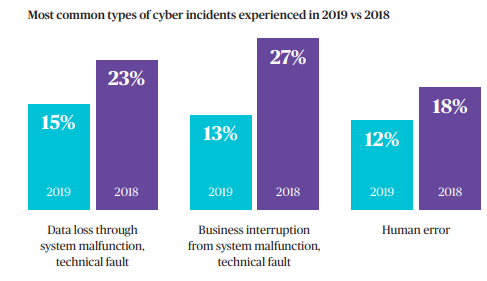

# Cyber Risk

1. Skills Gap, both from IT and Leadership
2. Focus on Technology
3. 
Incentives

Pro's

* Increased revenue w

Culture

References

[https://www.chubb.com/au-en/articles/australia-sme-cyber-preparedness-report-2019.aspx](https://www.chubb.com/au-en/articles/australia-sme-cyber-preparedness-report-2019.aspx)

